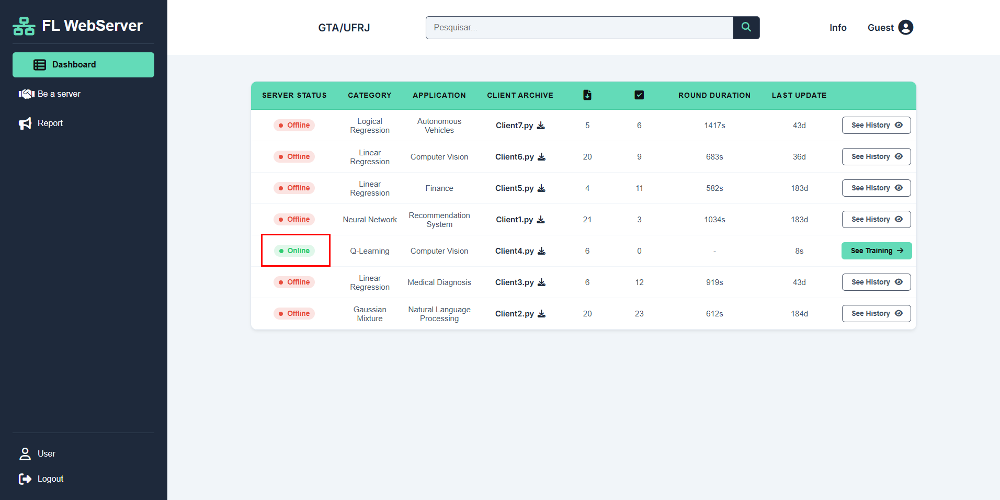
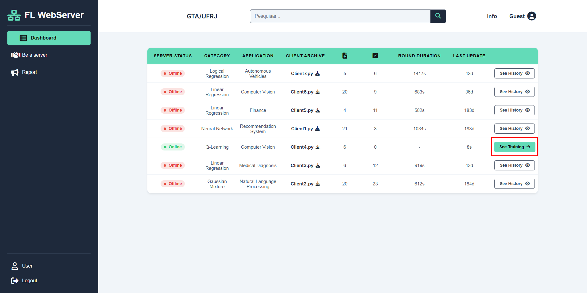
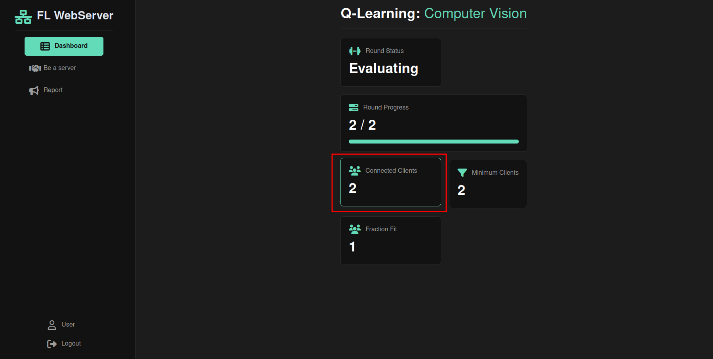
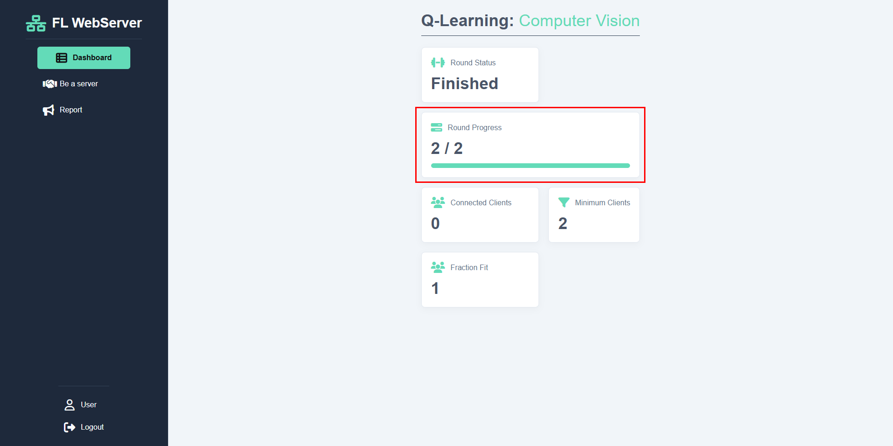
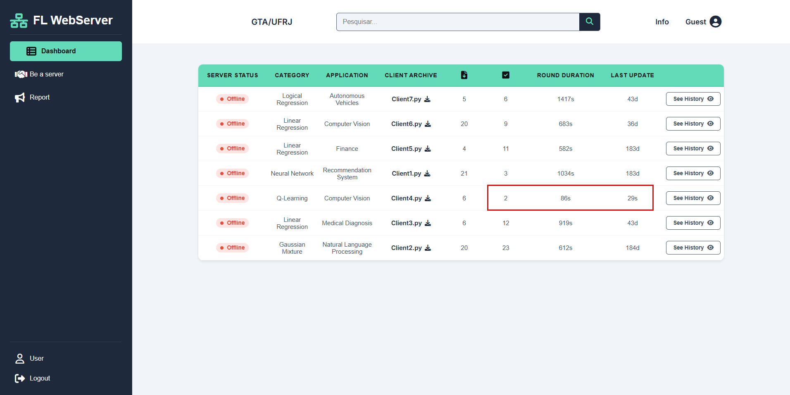
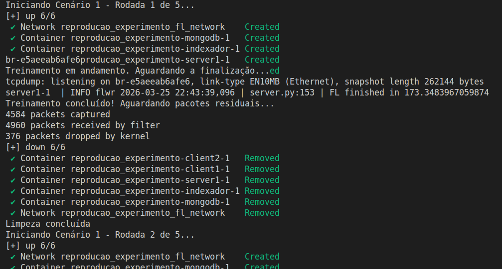

# FLeer2FLeer: Uma Ferramenta Web Baseada em Arquitetura Par-a-Par para Orquestração do Aprendizado Federado

O objetivo deste artefato é disponibilizar a ferramenta **FLeer2FLeer**, permitindo tanto visualizar o uso da ferramenta e suas principais funcionalidades, quanto reproduzir o experimento de tráfego de rede relatado no artigo.

Para garantir uma melhor organização e entendimento da ferramenta, o projeto foi dividido em tres pastas:
1. **Demo Visual (`/demo_visual`)**: Responsável por possibilitar a visualização da interface da ferramenta e suas funcionalidades.
2. **Reprodução de Experimentos (`/reproducao_experimentos`)**: Responsável por reproduzir fielmente o experimento citado, extraindo as métricas de tráfego (.pcap) de múltiplos cenários e analisando com o script pyhton.
3. **A Ferramenta (`/src`)** : Onde estão localizados todos os arquivos que fazem parte do F2F.
---

## Selos Considerados
Os autores reivindicam os seguintes selos científicos para este artefato:
* Artefatos Disponíveis (SeloD);
* Artefatos Funcionais (SeloF);
* Artefatos Sustentáveis (SeloS);
* Experimentos Reprodutíveis (SeloR);

---

## Informações Básicas e Requisitos

Os experimentos foram testados em dois ambientes, com as seguintes especificações:

Ambiente 1 (mínimo):
* **Sistema Operacional:** Ubuntu 20.04/22.04, Debian 12 .
* **Hardware Mínimo:** 2 CPUs (2.0GHz) e 8GB de memória RAM.
  
Ambiente 2 (sugerido):
* **Sistema Operacional:** Ubuntu 20.04/22.04, Debian 12 .
* **Hardware sugerido:** Intel i9-10900 CPUs, 32GB RAM, 20 threads.

> Como todos os códigos são executados em containeres Docker e a escala dos experimentos é pequena, espera-se que o usuário consiga reproduzir fielmente os experimentos em máquinas com baixa capacidade de processamento e com SO compatível com Docker, o que levou a estimativa do ambiente mínimo 

---

## Dependências
A seguir, são apresentados os passos necessários para configurar as dependências:

1. Git
2. **Docker e Docker Compose:** Essenciais para subir a infraestrutura e rodar os scripts analíticos finais.
3. **Tcpdump e Tshark:** Necessários apenas para a etapa de Reprodução de Experimentos (captura e análise de pacotes).

**Instalação rápida das ferramentas de rede (Linux/Ubuntu):**

```bash
sudo apt update
sudo apt install docker-ce docker-compose-plugin tcpdump -y
```

## Visualização da Ferramenta (Demo Visual)

1. Acesse o diretório onde esta contido os arquivos Docker responsáveis pela demonstração:

```bash
cd demo_visual
```
2. Inicialize o Banco de Dados e o Indexador

```bash
sudo docker compose up -d
```
Aguarde o download dos pacotes e módulos e, quando o comando terminar de rodar no terminal, acesse http://localhost:4000. Você verá o Dashboard centralizado com dados de treinamentos anteriores, uma barra de navegação onde pode realizar buscas nas áreas de `Category` e `Application` e um menu lateral com outros dois módulos (`Be a Server` e `Reports`) do F2F.

3. Inicie um treinamento federado:

```bash
sudo docker compose -f docker-compose-treino.yml up -d --build
```

* Volte ao navegador e veja o campo `Server Status` do servidor iniciado ficar com o indicador `online` após aguardar um tempo de inicialização, da ordem de alguns minutos. Observe que isso acontece quando os contêineres se iniciam no terminal.

* Clique no campo `See Training` para acompanhar o treinamento e aguarde os clientes baixarem os datasets. 

* Espere os clientes se conectarem, observando o valor na caixa `Connected Clients` aumentar até 2.

* Observe a caixa `Round Progress` indicando que treinamento completa os dois rounds estipulados pelo servidor, passando por todos os estágios do Aprendizado Federado com o Flower (caixa `Round Status` indica o estágio).

* Clicando em `Dashboard` no menu lateral, volte para visualizar os campos `Round Duration` (duração média da rodada, em segundos) e `Last  Update` (momento em que treinamento finalizou, com tempo desde a última atualização do servidor).


4. É possível rodar o treinamento novamente e acompanhar a nova execução repetindo o passo a passo descrito(os dados das execuções anteriores são mantidos e atualizados).

```bash
sudo docker compose -f docker-compose-treino.yml down
sudo docker compose -f docker-compose-treino.yml up -d --build
```

5. Após terminar a visualização da demo, faça uma limpeza para não causar conflito com a etapa de experimentos, limpando a infraestrutura destruindo os volumes:

```bash
sudo docker compose -f docker-compose-treino.yml down
sudo docker compose down -v
cd ..
```

## Reprodução do Experimento do artigo
Esta etapa possibilita recriar os 5 cenários descritos no artigo. O script inicia os cenários, captura o tráfego gerado pelas portas do Flower (8080) e do Indexador (3000), gera os arquivos `.pcap` e destrói o ambiente para o próximo ciclo.

1. Acesse o diretório de experimentos:

```bash
cd reproducao_experimentos
```

2. Dê permissão de execução ao script:
   
```bash
chmod +x rodar_experimentos.sh
```

3. Execute os experimentos:

Por ser um processo demorado, a fim de facilitar a reprodução o script possibilita ajustar o número de cenários (1 até 5) e o número de rodadas (1 até 5). O recomendável para uma validação mais rápida são 2 cenários e 2 rounds. Caso deseje rodar a bateria completa do artigo, basta executar sudo ./rodar_experimentos.sh sem parâmetros.

```bash
sudo ./rodar_experimentos.sh rounds=2 cenarios=2
```

Este processo leva tempo, pois treina modelos de Machine Learning reais em contêineres e aguarda o tempo de sincronização da rede. O comando exige privilégios de administrador (sudo) para habilitar o tcpdump e controlar o Docker.

Exemplo dos logs no início do comando:


4. Análise dos Resultados:

Após o script exibir a mensagem de sucesso, os arquivos `.pcap` estarão na mesma pasta (`reproducao_experimento`). Para gerar os resultados, utilize os scripts em Python fornecidos:

> Garanta que você está dentro da pasta `reproducao_experimentos` no terminal antes de executar esses próximos comandos

Para ver a média de tráfego por cenário (FL x Indexador):
```bash
cd analise_completa
sudo docker compose up -d
```
O script gera um `.txt`, Volte para o diretório anterior e exiba a análise no seu terminal:

```bash
cd ..
# (Opcional) Lista os arquivos .txt para confirmar o nome
ls *.txt

# Exibe o relatório de análise diretamente no terminal
cat analise_completa.txt
```

Limpeza 1: 

```bash
sudo docker compose down
cd ..
```

Para ver o tráfego isolado por IP de cada servidor:

```bash
cd analise_por_servidor
sudo docker compose up -d
```

Exiba a análise por IP no seu terminal:

```bash
cd ..
# (Opcional) Lista os arquivos .txt para confirmar o nome
ls *.txt

# Exibe o relatório de análise diretamente no terminal
cat analise_completa.txt
```

Limpeza 2: 

```bash
sudo docker compose down
cd ..
```

## Preocupações com segurança

A execução dos experimentos e contêineres não apresenta riscos de segurança conhecidos para os revisores. O uso do sudo é exigido estritamente pelo utilitário tcpdump para permitir a "escuta" das interfaces de ponte de rede (br-) geradas dinamicamente pelo Docker durante os testes.